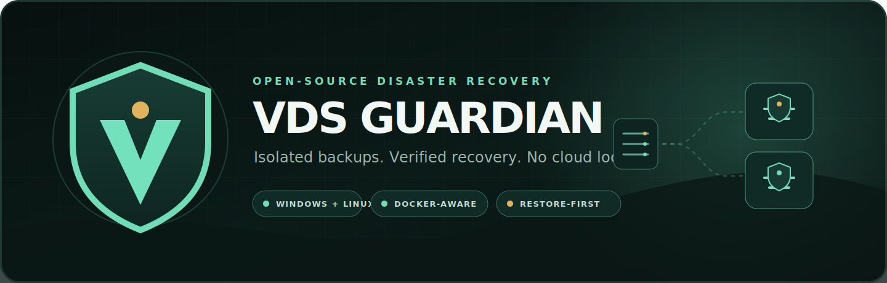

<p align="center">
  
</p>

<p align="center">
  <a href="https://github.com/ProAnima/VDS-Guardian/actions/workflows/ci.yml"></a>
  <a href="LICENSE"></a>
  
  
</p>

VDS Guardian is an open-source desktop and headless disaster-recovery manager
for remote Linux servers. It is built for operators who need isolated,
independently stored recovery points and a predictable path from a failed or
compromised VDS to a clean, working deployment.

The project focuses on Docker-based workloads, database-consistent capture,
cryptographically verified manifests, and dry-run-first restoration without a
mandatory cloud service.

> **Project status:** Milestone 1 / local repository foundation. The first
> fail-closed staging, verification, Ed25519 identity, quarantine, atomic seal,
> and whole-directory retention slices are implemented and tested with
> simulated sources. Signing enrollment now has a locked, crash-recoverable
> application service plus explicit JSON CLI and Tauri bridge commands; the
> desktop setup screen is not wired yet. Live backup and
> restore operations remain disabled. Do not use it as a disaster-recovery
> system until the restore-drill gate in the roadmap is complete.

## Design goals

- One Rust backup engine shared by the desktop GUI and a headless CLI.
- First-class Windows and Linux support; no WSL requirement on Windows.
- A separate sealed directory for every completed backup.
- A staging-to-sealed lifecycle so failed or suspicious runs never become
  restorable backups.
- SHA-256 manifests, signed metadata, verification, quarantine, retention, and
  restore drills.
- Docker Compose metadata, bind mounts, named volumes, databases, system
  configuration, and operator-selected paths captured through explicit plans.
- Multiple installations can keep independent repositories and schedules.
- SSH private keys live in the OS credential store or an operator-selected
  file outside the repository. Secrets are never embedded in source code or
  committed configuration.
- Destructive actions are dry-run-first, auditable, and require explicit
  confirmation.

## Chosen stack

- **Core and CLI:** Rust 2024 edition.
- **Desktop shell:** Tauri 2.
- **UI:** React 19, strict TypeScript, Vite.
- **Remote transport:** OpenSSH-compatible SSH/SFTP behind a narrow Rust port.
- **Backup payload:** deterministic `tar` + Zstandard streams, one payload per
  backup, with a versioned manifest. Database-aware adapters use native dump
  tools instead of copying live database files.
- **Secrets:** Windows Credential Manager / Secret Service-compatible keyring,
  with optional encrypted local vault as a later fallback.

The architecture decision and rejected alternatives are documented in
[`docs/adr/0001-platform-and-stack.md`](docs/adr/0001-platform-and-stack.md).

## Repository layout

```text
apps/desktop/          Tauri desktop shell and React UI
crates/guardian-core/  Domain model and use cases; no UI or Tauri dependency
crates/guardian-local-repository/  Cross-platform staging and seal adapter
crates/guardian-signing/  Ed25519 backup-node identity lifecycle
crates/guardian-os-keyring/  Windows/Linux secure credential-store adapter
crates/guardian-cli/   Headless Linux/Windows entrypoint
docs/                  Architecture, security, backup format, and roadmap
scripts/               Canonical doctor and verification entrypoints
```

## Development

Prerequisites: Node.js 22+, npm 10+, Rust 1.96, and the platform prerequisites
listed by Tauri 2. On Linux, WebKitGTK development packages are required for the
desktop shell; the headless CLI does not need them.

```powershell
npm.cmd install
npm.cmd run doctor
npm.cmd run verify
npm.cmd run dev
```

Linux:

```bash
npm install
npm run doctor
npm run verify
npm run dev
```

The canonical gates are described in `AGENTS.md`. Do not replace them with an
informal list of partial checks.

Signing identity inspection is read-only and never enrolls implicitly. The
headless CLI requires an explicit absolute node-configuration path:

```powershell
guardian-cli signing status --config-dir D:\VDSGuardian\node --json
guardian-cli signing enroll --config-dir D:\VDSGuardian\node --json
```

On headless Linux, enrollment fails closed unless a supported Secret Service is
available; the encrypted-vault fallback remains future work.

## Security boundary

VDS Guardian assumes the remote server may already be compromised. A backup
worker therefore receives only the access required by its reviewed backup plan,
never executes data from the backup, writes only to a fresh staging directory,
and publishes it by an atomic rename after verification. Completed backup
directories are not reused or modified by normal application flows.

Storage isolation limits propagation and operator mistakes; it is not a malware
scanner and cannot make a backup trustworthy by itself. See
[`docs/SECURITY_MODEL.md`](docs/SECURITY_MODEL.md) for the full threat model and
[`docs/SIGNING_IDENTITY.md`](docs/SIGNING_IDENTITY.md) for the node-key contract.
Retention safety and interrupted-cleanup behavior are specified in
[`docs/RETENTION.md`](docs/RETENTION.md).

## Roadmap

The milestone plan, acceptance gates, and definition of done are in
[`docs/DEVELOPMENT_PLAN.md`](docs/DEVELOPMENT_PLAN.md).

## Contributing

Read `AGENTS.md`, `CODEX.md`, and `CONTRIBUTING.md` before changing code. Security
issues should follow `SECURITY.md` and should not be filed publicly until a safe
disclosure path is available.

## License

Licensed under the [Apache License 2.0](LICENSE).
